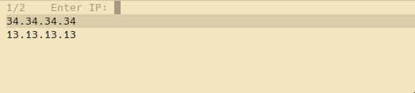

# easy-ssh for emacs
Are you working with multiple ssh hosts? 
Is it annoying to write "/ssh" in tramp or #port each time you want to connect to your host? Then this small tool will be useful to you.

**What this function will do**

* Prompts you for host and desired ip upon call

* Displays a list of previous hosts and ports for quick completion

**How to install?**
First copy the file to your emacs.d

    git clone --depth 1 https://github.com/kagetora66/easy-ssh /tmp/easy-ssh && \
    cp /tmp/easy-ssh/*.el ~/.emacs.d/ && \
    rm -rf /tmp/easy-ssh
    
Then add this line to your emacs initialization file

    `(load "~/.emacs.d/easy-ssh.el")`
